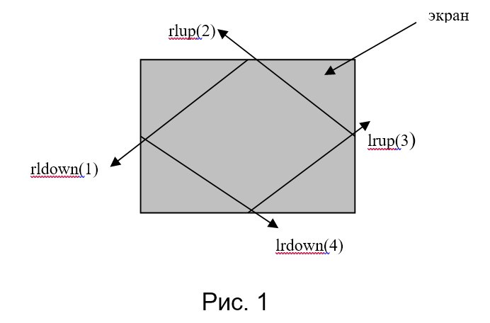

Физика в курсовой 2005 года для игры типа "арканоид" описывается всего 4мя движениями шарика:
 
В основу организации игровой оболочки лежит принцип мультипликации.  
 
Спрайт, т.е. шарик двигается по миниэкрану игры путем перерисовки: уничтожается изображение  шарика  и  создается  вновь,  но  с  некоторым  небольшим  смещением. 
 
Важно отметить следующее наблюдение. 
 
В данной среде (представленной прямоугольным экраном) шарик может двигаться только в четырех направлениях, а именно (см. рис.1):  

 
- справа – налево вниз (1);
- справа – налево вверх (2);
- слева – направо вверх (3);
- слева – направо вниз (4);
 
Собственно говоря, именно это наблюдение и является всей логикой и базой условий движения шарика в системе миниэкрана игры. 
Это наблюдение описано в функции void moving(int i, int j, int func); 
 
причем эта функция совершает только 1 шаг в одном из указанных четырех направлениях. 

Параметры этой функции: точка (i, j) –текущая координата  центра шарика, func – направление движения. 
 
Угол падения шарика всегда равен углу отражения.
